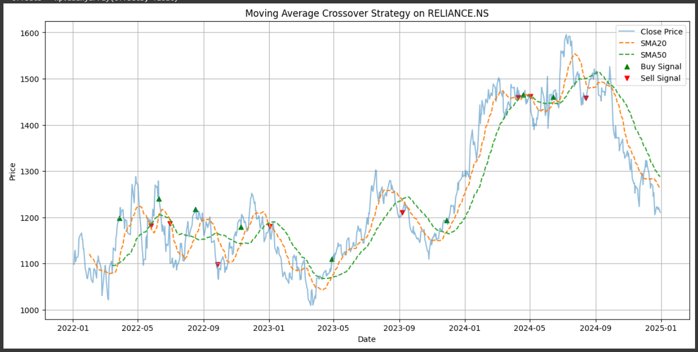

This project implements a simple algorithmic trading strategy using Python, where trades are executed based on the crossover of 20-day and 50-day Simple Moving Averages (SMA). All trades are automatically exported to Google Sheets.

- Fetches historical stock data using `yfinance`
- Calculates SMA20 and SMA50
- Generates Buy/Sell signals when SMAs cross
- Visualizes strategy with `matplotlib`
- Exports trade signals to Google Sheets using `gspread`

- Python, Jupyter Notebook, Google Colab
- `pandas`, `yfinance`, `matplotlib`, `gspread`

## 🔗 Google Sheet

[View Trade Signals Sheet](https://docs.google.com/spreadsheets/d/1ODxB_nV7r0q_WB21IxrqLkxtSu6ToI9iR-9kQHKxLwg/edit?usp=sharing)  

## 🧑‍💻 Author

Vidya Charan  
[LinkedIn](https://www.linkedin.com/in/jvcharan/) | [GitHub](https://github.com/VidyaCharanChoudari)

